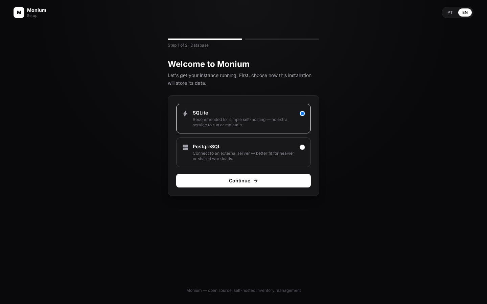
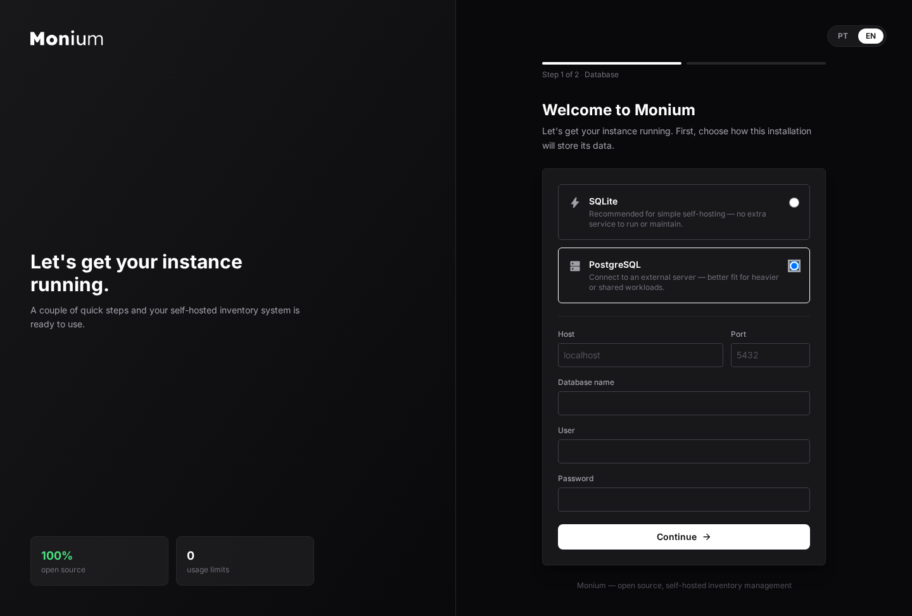
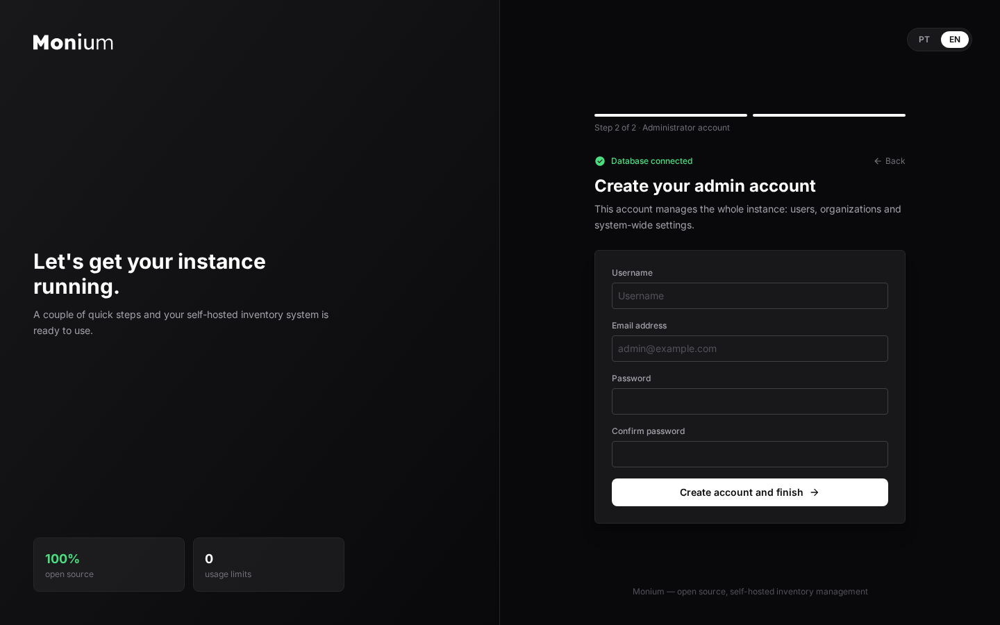
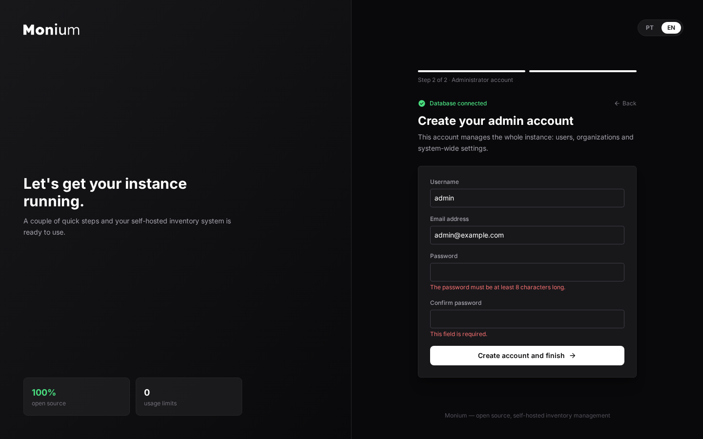

# Monium

[](LICENSE)

Monium é um sistema open source e self-hosted de gestão de inventário e
ativos que substitui planilhas por um sistema único para rastrear
equipamentos, empréstimos internos e manutenção — com controle
multi-organização e alertas automáticos, sem limites de uso ou custo de
licença.

## Principais recursos

- **Inventário**: cadastro de itens com categoria, setor, localização, marca,
  status e condição; dashboard com visão geral e distribuição por categoria/setor.
- **Empréstimos**: registro de empréstimos internos com detecção automática de
  atraso e alerta por e-mail.
- **Manutenção**: registro de manutenções por item, com acompanhamento de
  status para saber o que está parado para reparo.
- **Importação/exportação de itens via CSV**: cadastro em massa a partir de
  uma planilha existente e exportação da base para análise externa.
- **Multi-organização**: cada conta pertence a uma ou mais organizações
  (dono/membro), com onboarding obrigatório na criação da conta, sem limite
  de organizações, membros ou itens.
- **Auditoria e segurança**: log estruturado por camada (acesso, negócio,
  segurança, performance, erros, banco de dados) com dashboards internos,
  bloqueio por tentativas de login (exponential backoff) e trilha de
  auditoria de alterações em modelos sensíveis.
- **Contas**: cadastro, login, recuperação de senha, avatar, exclusão de
  conta com período de carência.

> As páginas públicas de "Serviços" e "FAQ" que existiam no site foram
> removidas — o conteúdo real de funcionalidades vive só aqui no README, para
> não haver duas fontes de verdade (e a segunda dessincronizar do código).

## Stack

- **Backend**: Django 5.2. Sem Celery/broker: as únicas duas tarefas de fundo
  (auditoria e checagem de empréstimos atrasados) rodam de forma síncrona ou
  via um scheduler simples embutido no `gunicorn.conf.py` — ver
  `python manage.py check_overdue_loans`. Cache numa tabela própria do banco
  configurado (sem Redis).
- **Frontend**: Tailwind CSS + TypeScript (compilado via esbuild), templates
  Django server-side.
- **Banco de dados**: SQLite (padrão, zero configuração) ou PostgreSQL (servidor
  externo) — escolhido no instalador de primeiro uso, ver abaixo.
- **Infra**: Docker Compose. O próprio Django/gunicorn serve os arquivos
  estáticos via WhiteNoise — sem reverse proxy dedicado.

## Instalação (Docker Compose)

```bash
git clone <url-do-repositorio> monium
cd monium
cp src/.env.example src/.env
# edite src/.env — no mínimo DJANGO_SECRET_KEY e DJANGO_ENCRYPTION_KEY
# (veja os comandos de geração nos comentários do próprio arquivo)

docker compose pull
docker compose up -d
```

Isso baixa a imagem já pronta publicada em
`ghcr.io/syspe-tech/monium` — não precisa compilar nada localmente.
Se preferir construir a imagem a partir do código-fonte (por exemplo,
para testar uma alteração antes de contribuir), troque as duas últimas
linhas por `docker compose up -d --build`.

Acesse `http://localhost:8088/` (porta configurável via `APP_PORT` no
`.env`) e siga o instalador — próxima seção.

> **Upload de arquivos**: avatar de usuário, logo de organização e fotos de
> item dependem de um serviço de storage HTTP externo (variáveis
> `STORAGE_BASE_URL`/`STORAGE_TOKEN`), que **não está incluído neste
> repositório**. Sem isso configurado, a aplicação funciona normalmente,
> mas upload de arquivos falha. Ver `src/.env.example` para detalhes.

## Primeira execução

Sem `DB_ENGINE` definido no `.env`, a aplicação sobe em modo instalador: toda
navegação é redirecionada para `/setup/`. O fluxo é:

1. **Banco de dados** (`/setup/database/`) — escolha SQLite (recomendado para
   uso simples, nenhum serviço extra necessário) ou informe host/porta/usuário/
   senha de um PostgreSQL externo. A conexão é testada (roundtrip de escrita)
   antes de qualquer coisa ser salva. Escolhendo SQLite, a configuração é
   aplicada na hora; escolhendo PostgreSQL, a aplicação reinicia sozinha (via
   `restart: always`) pra aplicar a nova configuração.

   | SQLite | PostgreSQL |
   | --- | --- |
   |  |  |

2. **Administrador** (`/setup/admin/`) — depois do banco confirmado e
   migrado, cria a primeira conta de superusuário antes de liberar o resto do
   sistema.

   | Criação de conta | Validação de erros |
   | --- | --- |
   |  |  |

A configuração escolhida fica persistida em `APP_DATA_DIR/database.env` (um
volume Docker — `app_data` no `compose.yml`), sobrevivendo a recriações do
container. Quem preferir configurar o banco manualmente pode simplesmente
definir `DB_ENGINE`/`DB_NAME`/`DB_USER`/`DB_PASSWORD`/`DB_HOST`/`DB_PORT` no
`.env` — o instalador é pulado inteiramente nesse caso.

## Desenvolvimento

```bash
cd src
uv sync                       # dependências Python
npm install && npm run build  # assets (Tailwind + TypeScript)
cp .env.example .env          # ajuste os valores
uv run python manage.py migrate
uv run python manage.py runserver
```

## Perguntas frequentes (FAQ)

**O Monium é realmente gratuito?**
Sim. É open source (AGPLv3), sem limite de uso, sem plano pago e sem cartão
de crédito. Você roda a própria instância na sua infraestrutura, então não
há assinatura para gerenciar.

**Como eu faço o self-host?**
Via Docker Compose — ver a seção [Instalação](#instalação-docker-compose)
acima. Não há worker/broker separado: as únicas tarefas de fundo rodam
síncronas ou por um scheduler simples embutido no próprio processo do
`gunicorn`.

**Onde meus dados ficam armazenados?**
Inteiramente na infraestrutura que você escolher para rodar o Monium — SQLite
local ou um PostgreSQL que você aponte. Por ser self-hosted, nenhum dado é
enviado a serviços de terceiros pelo próprio projeto.

**Existe limite de itens, usuários ou organizações?**
Não. O Monium não impõe limites artificiais — o único limite real são os
recursos do servidor onde você o executa.

**Como meus dados são protegidos?**
Senhas são armazenadas com hash (nunca em texto puro), há bloqueio
progressivo de tentativas de login (exponential backoff) e trilha de
auditoria para alterações em modelos sensíveis. Campos sensíveis de
configuração (como credenciais SMTP) são armazenados criptografados via
`DJANGO_ENCRYPTION_KEY`. TLS em trânsito e backups do banco são
responsabilidade de quem opera a instância (normalmente via reverse proxy
como Nginx na frente do Docker Compose).

**Dá para importar meu inventário existente de uma planilha?**
Sim, há importação e exportação de itens via CSV (ver `item_import.py` /
`item_export_view.py` no app `inventory`).

**O Monium tem aplicativo mobile?**
Não como app nativo — a interface é web responsiva e funciona no navegador
de qualquer celular.

**Posso contribuir ou pedir uma funcionalidade?**
Sim, é open source — issues e pull requests são bem-vindos no repositório.

## Privacidade e LGPD

Por ser um software **self-hosted**, o projeto Monium em si não processa
dados de ninguém — quem opera uma instância (você, ou a sua organização) é
quem assume o papel de controlador de dados perante a LGPD, e deve avaliar
suas próprias obrigações (DPO, canal de atendimento a titulares, políticas de
retenção etc.) de acordo com o contexto de uso. As notas abaixo descrevem o
que **o software processa**, para embasar essa avaliação — não substituem uma
política de privacidade própria de quem faz o deploy.

- **Dados de conta**: nome completo, e-mail, username e senha (armazenada
  como hash, nunca em texto puro).
- **Dados de perfil**: avatar e demais campos opcionais preenchidos pelo
  próprio usuário.
- **Dados de uso**: logs estruturados de acesso, ações de negócio, eventos de
  segurança e erros — usados para auditoria e diagnóstico, ficam no banco da
  própria instância.
- **Dados de inventário**: descrições de itens, localizações, responsáveis e
  demais informações cadastradas pelos usuários da organização.

**Bases legais típicas (LGPD, Art. 7º)** para o processamento acima: execução
de contrato/uso do serviço (cadastro, autenticação, funcionalidades de
inventário), interesse legítimo (monitoramento de segurança e prevenção a
fraude) e cumprimento de obrigação legal, quando aplicável.

**Retenção**: dados de conta ficam ativos enquanto a conta existir; ao
solicitar exclusão, há um período de carência antes da remoção definitiva
(ver função de exclusão de conta em `account`). Logs de auditoria e
segurança ficam retidos conforme a configuração de banco de dados de cada
instância — não há expurgo automático embutido hoje.

**Cookies**: o Monium usa apenas cookie de sessão, necessário para
autenticação. Não há cookies de rastreamento ou scripts de analytics
de terceiros embutidos na aplicação.

**Direitos dos titulares (Art. 18 LGPD)** — acesso, correção, exclusão,
portabilidade, oposição e revogação de consentimento — devem ser atendidos
pelo controlador de dados de cada instância (ou seja, por quem opera o
deploy), já que o projeto Monium não tem acesso aos dados de instâncias de
terceiros.

## Licença

Distribuído sob a [GNU Affero General Public License v3.0](LICENSE). Em
resumo: você pode usar, modificar e redistribuir livremente, inclusive
rodando uma instância própria — mas se você rodar uma versão modificada como
serviço de rede acessível a terceiros, é obrigado a disponibilizar o código
dessa versão modificada para os usuários desse serviço.
